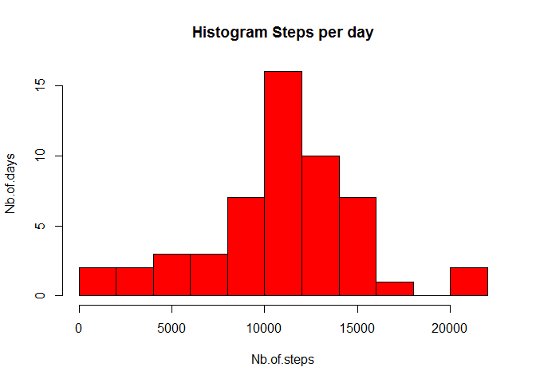
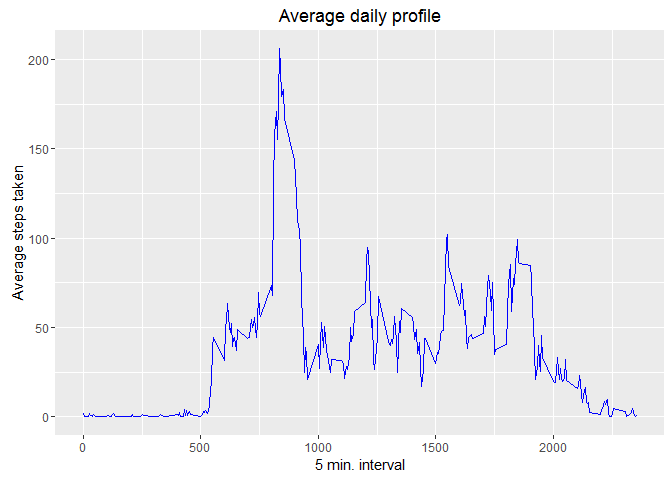
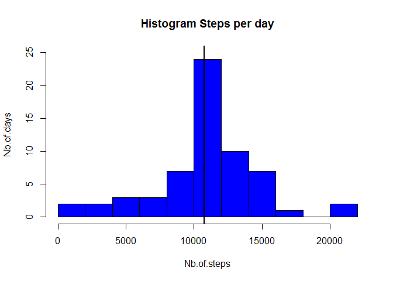
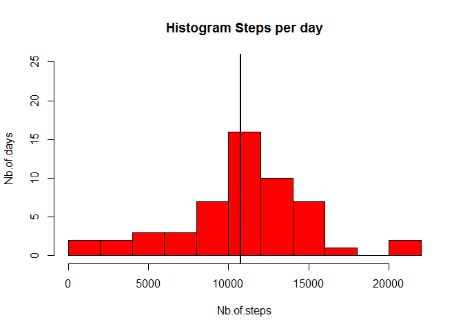
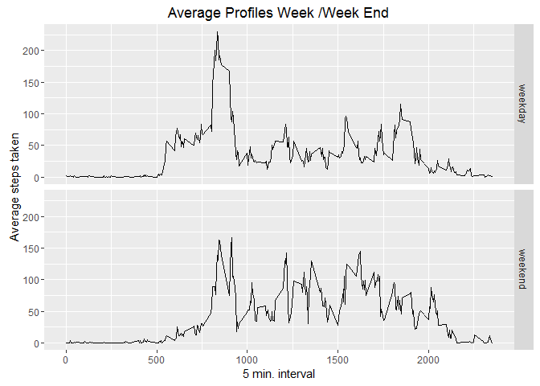

# Reproducible Research: Peer Assessment 1

## Loading and preprocessing the data
First setting wd and oading necessary libraries
Then unzipping file and reading it as data.frame


```r
setwd("C:/Users/MZ/Documents/COURSERA/RepData_PeerAssessment1/")
library("dplyr")
library("ggplot2")
unzip("activity.zip")
activityData<-read.csv("activity.csv")
```


## What is mean total number of steps taken per day?

Pre-processing raw data to compute the asked values: 

```r
nb.steps.each.day<-na.omit(activityData)%>% 
     group_by(date)%>%
     summarise(total.steps=sum(steps))
```


Plotting the histogramm 

<!-- -->
   
   This is the median value of steps taken a day: 


```r
median(nb.steps.each.day$total.steps)
```

```
## [1] 10765
```
   This is the mean value of steps taken a day:

```r
mean(nb.steps.each.day$total.steps)
```

```
## [1] 10766.19
```

## What is the average daily activity pattern?

```r
average.profile<-na.omit(activityData)%>% 
     group_by(interval)%>%
     summarise(mean.steps=mean(steps))
```


```r
ggplot(data=average.profile,
       aes(x=interval,y=mean.steps))+
     geom_line(col="blue")+
     xlab("5 min. interval")+
     ylab("Average steps taken")+
     ggtitle("Average daily profile")
```

<!-- -->

   The maximum number of steps taken is reached on average for the following time interval number: 
 
 ```r
 as.numeric(average.profile[which(average.profile$mean.steps==max(average.profile$mean.steps)),"interval"])
 ```
 
 ```
 ## [1] 835
 ```

## Imputing missing values

* Checking the number NA values for the steps variable: 

```r
sum(is.na(activityData$steps))
```

```
## [1] 2304
```
* Replacing the NA values by the average value observed on the corresponding interval:


```r
ind.missingvalues<-which(is.na(activityData$steps))
activityData_filled<-activityData

for (i in ind.missingvalues){
     ref.interval<-activityData_filled$interval[i]
     activityData_filled$steps[i]<-
          average.profile$mean.steps[which(average.profile$interval==ref.interval)]
}

sum(is.na(activityData_filled$steps))
```

```
## [1] 0
```

* Computing again the mean and median values for daily activity: 

```r
nb.steps.each.day_filled<-na.omit(activityData_filled)%>% 
     group_by(date)%>%
     summarise(total.steps=sum(steps))

mean(nb.steps.each.day_filled$total.steps)
```

```
## [1] 10766.19
```

```r
median(nb.steps.each.day_filled$total.steps)
```

```
## [1] 10766.19
```
* Checking that it only affects in a marginal way the previously computed values

```r
mean(nb.steps.each.day_filled$total.steps)-mean(nb.steps.each.day$total.steps)
```

```
## [1] 0
```

```r
median(nb.steps.each.day_filled$total.steps)-median(nb.steps.each.day$total.steps)
```

```
## [1] 1.188679
```
   
      For his, you can also plot the histrogramm with imputed missing values (here in blue) to compare it to the previously drawn histogramm (here in red again):
      
      

```r
hist(nb.steps.each.day_filled$total.steps,10,
     col="blue",
     ylab="Nb.of.days",
     xlab="Nb.of.steps",
     main="Histogram Steps per day",
     ylim=c(0,25))
abline(v=median(nb.steps.each.day_filled$total.steps),col="black",lwd=2)
```

<!-- -->


```r
hist(nb.steps.each.day$total.steps,10,
     col="red",
     ylab="Nb.of.days",
     xlab="Nb.of.steps",
     main="Histogram Steps per day",
     ylim=c(0,25))
abline(v=median(nb.steps.each.day$total.steps),col="black",lwd=2)
```

<!-- -->
There is no significant impact on average and median values for overall daily activity.


## Are there differences in activity patterns between weekdays and weekends?

* Sorting week-related records from week-end related records and computing average profiles: 


```r
activityData_filled$day.type<-ifelse(as.POSIXlt(activityData_filled$date)$wday %in% 
                                          c(0,6),"weekend","weekday")


weekday.average.profiles<-aggregate(steps~interval+day.type,
                                    data=activityData_filled,
                                    mean)
```

* Plotting the two average profiles 


```r
ggplot(weekday.average.profiles,
       aes(x=interval,y=steps))+
     geom_line()+
     ggtitle("Average Profiles Week /Week End")+
     facet_grid(day.type~.)+
     xlab("5 min. interval")+
     ylab("Average steps taken")
```

<!-- -->

 
